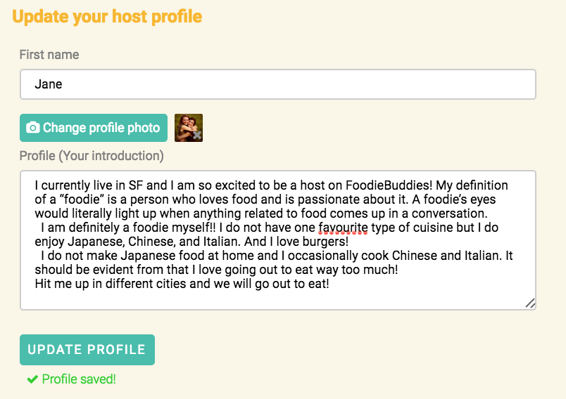

# FoodieBuddies

[FoodieBuddies live][live-link]

[heroku]: https://foodiebuddies.herokuapp.com/
[live-link]: http://www.foodiebuddies.net/


FoodieBuddies is a full-stack web application inspired by [Tea With Strangers][TeaWithStrangers]. It aims to connect people through food-related events. We all love food and making new friends, so why not combine the two?
FoodieBuddies utilizes Ruby on Rails on the backend, a PostgreSQL database, and React.js with a Redux architectural framework on the frontend.

[TeaWithStrangers]: http://www.teawithstrangers.com/

## Features & Implementation

### Single-Page App

FoodieBuddies is single-page; all content is delivered on one static page. It utilizes `react-router`'s `onEnter` hook to redirect user based on whether the content on a page requires the user to be logged in.

### User Privacy

Sensitive information like passwords are kept out of the frontend of the app by making an API call to `UsersController#create` for sign up or `SessionsController#create` for log in to check the user credentials. Password is never saved anywhere throughout the process; user is validated using `password_digest`, which is a hash of the password.


```ruby
class Api::SessionsController < ApplicationController
  def create
    @user = User.find_by_credentials(session_params["username"], session_params["password"])

    if @user
      login(@user)
      render "api/users/show"
    else
      render(json: ["Invalid username/password combination"], :status => 401)
    end
  end
end
  ```

### View events and hosts by city

  On the database side, the cities, hosts, and events are each stored in a table. The cities table contain columns for `id`, `name`, `country`, and `pic_url`. The hosts are a subset of the users table, which contains columns for `id`, `name`, `country`, and `pic_url`  Upon entering a city's page, the router checks if the user is logged in; upon login, an API call is made to the database city table and filters by the parameter's `cityId` using `id` column. The hosts and events that belong to the city through associations are also fetched upon this call. The events are listed in chronological order.

  Each city's show page show up with a list of the events and hosts nicely displayed in tiles. See pictures below:


  Pictures are hosted on cloudinary to provide a consistent link and uniform image sizing.

### Dashboard to view events you are attending and events you are hosting

The dashboard link and view is provided to a user upon logging in. User can view the events that they are attending as well as the events that they are hosting (if they are a host for any of the cities). The events are listed in chronological order as well. This is done by exporting all the events as a javascript object containing each event as an object, along with an array of the event ids in chronological order. The events are then displayed based on the order of this array.


### Sign up as a host; edit host profile; host profile view

Any logged in user can sign up as a host in the city of their choice. Once signed up, the user can edit and access their profile in the account page anytime.





### Create, edit, delete events as a host

Once a user has host credentials, they have the ability to created an event with the event creation form.


Upon event creation, the host will see the event in their dashboard, and have the ability edit and delete the event.


### Event listing and attend/unattend events on the event listing

In addition to viewing all events of a city as well as events in the dashboard, user can also join or un-join an event with a click of a button on the event item:


If you are the host of the event, you will not have the join button but instead the edit and delete authorization, as mentioned in the section above.


## Future Directions for the Project

In addition to the features already implemented, I plan to continue work on this project.  Some additional features includes:

### Integration with Google Map API
- [ ] Viewing events by city to pull up a city map and mark all the events on Google Map
- [ ] Add events by address to add new markers on map
- [ ] Google Map API showing events based on address

### Integration with Google Calendar API
- [ ] Ability to set reminders on events and add events to calendar

### Search
- [ ] Search events by type of food
- [ ] Search events by hosts

### Integration with Yelp API
- [ ] Restaurant suggestions based on the city
- [ ] Restaurant details, menus, and rating displayed on the event
- [ ] Adjust event time based on restaurant hours
